# 🏠 ControlSphere — Smart Home Automation System in C++17


> A console-based smart home simulation developed with modern C++17, focusing on modular design, object-oriented programming, access control, and automated device coordination.

---

## 📖 Overview

ControlSphere is a terminal-based smart home automation system developed in **C++17**. It provides a simulated residential environment where users can manage appliances, monitor room devices, configure security features, and execute automation routines through a menu-driven interface.

The simulation includes two rooms:

- **Living Room**
- **Bedroom**

Each room is equipped with a predefined set of smart devices:

- **Light**
- **Fan**
- **Air Conditioner (AC)**
- **Camera**
- **Door Lock**

The project was developed to demonstrate how modern C++ concepts can be applied to build a structured and maintainable system. It makes use of object-oriented design, encapsulation, polymorphism, smart-pointer-based resource management, and input validation to organize the different components of the application.

---

## ✨ Key Features

| Category | Capabilities |
|:---|:---|
| **Authentication** | Two-tier access control (`ADMIN` / `USER`), unique email-keyed account directory, duplicate account prevention, and clean session management |
| **Device Control** | Granular state manipulation for Lights, Fans, AC units, Cameras, and Door Locks with parameterized boundary validation |
| **Automation** | Multi-device coordinated routines: Good Morning, Good Night, Leaving Home, and Movie Mode |
| **Security** | Centralized security system supporting immediate arming, disarming, and real-time status reporting |
| **User Management** | Administrator-exclusive user administration: register new accounts, remove users, and verify account existence |
| **Input Validation** | Defensive stream guards against non-numeric entries, out-of-range menu selections, and illegal device operational parameters |

---

## 🔐 Authentication System

ControlSphere enforces a **role-based access control (RBAC)** model dividing access between two roles: `ADMIN` and `USER`.

- Dedicated login and session logout workflows
- Account identification keyed uniquely by email address
- Guardrails preventing duplicate email registrations
- Privilege verification upon credential validation
- Administrator-only operations for registering and deleting accounts
- Fast average-case account lookup powered by an in-memory STL `std::unordered_map`

> [!NOTE]
> **Learning & Demonstration Notice**: The authentication subsystem is designed strictly for demonstration and educational purposes. User accounts and sessions are maintained in memory for the duration of program execution. It does not implement password hashing, cryptographic encryption, or persistent database storage.

### 🔑 Default Demonstration Credentials

For evaluation and immediate testing, the system initializes a built-in administrator account:

| Attribute | Demonstration Value |
|:---|:---|
| **Email** | `admin@smarthome.com` |
| **Password** | `admin123` |
| **Role** | `ADMIN` |

---

## 🖥️ Dashboards

### Admin Dashboard
1. Control & View Devices
2. Automation
3. Security Status
4. Manage Users
5. Logout

### User Dashboard
1. Control & View Devices
2. Automation
3. Security Status
4. Logout

Standard users have full access to inspect rooms, operate individual appliances, execute automation routines, and view current security alarms. However, user administration capabilities (creating, listing, or removing accounts) remain strictly locked down to administrators.

---

## 🏘️ Room & Device Structure

| Room | Initialized Smart Devices |
|:---|:---|
| **Living Room** | Light, Fan, Air Conditioner (AC), Camera, Door Lock |
| **Bedroom** | Light, Fan, Air Conditioner (AC), Camera, Door Lock |

Every `Room` container automatically provisions its dedicated set of appliances upon construction. The topology maintains a fixed hardware layout reflecting a typical residential floorplan.

---

## 🔌 Device Functionality

| Device | Capabilities & Parameter Boundaries |
|:---|:---|
| **Light** | Toggle power state (ON / OFF), adjust brightness level (0–100%) |
| **Fan** | Toggle power state (ON / OFF), adjust speed settings (levels 1–3) |
| **AC** | Toggle power state (ON / OFF), set target cooling temperature (16–30 °C) |
| **Camera** | Toggle power state (ON / OFF), initiate and halt video recording |
| **Door Lock** | Engage lock, release unlock, verify current latch status |

All hardware classes inherit from the abstract base class `SmartDevice`, establishing a unified interface for state transitions across the appliance spectrum.

---

## 🛡️ Security System

The centralized `SecuritySystem` unit monitors the overall home perimeter state:

- **Arm** the security perimeter
- **Disarm** the security perimeter
- **Display** live system armed/disarmed status

```
Security Status: ARMED
```

---

## ⚙️ Automation

The **AutomationEngine** orchestrates batch state updates across multiple rooms and subsystems in response to daily home routines:

| Mode | Coordinated Subsystem Behavior |
|:---|:---|
| **Good Night** | Powers down living room lights, fans, and AC; turns off bedroom lights; locks the main door; arms security perimeter |
| **Good Morning** | Activates living room fan and AC; presets bedroom climate to 24 °C; unlocks main door; disarms security perimeter |
| **Leaving Home** | Powers off all lights, fans, and AC units across both rooms; secures main door lock; arms security perimeter |
| **Movie Mode** | Dims living room light to 30% brightness for entertainment ambiance |

These routines demonstrate synchronized coordination between independent device managers and security modules driven by a single invocation.

---

## 🏗️ Architecture

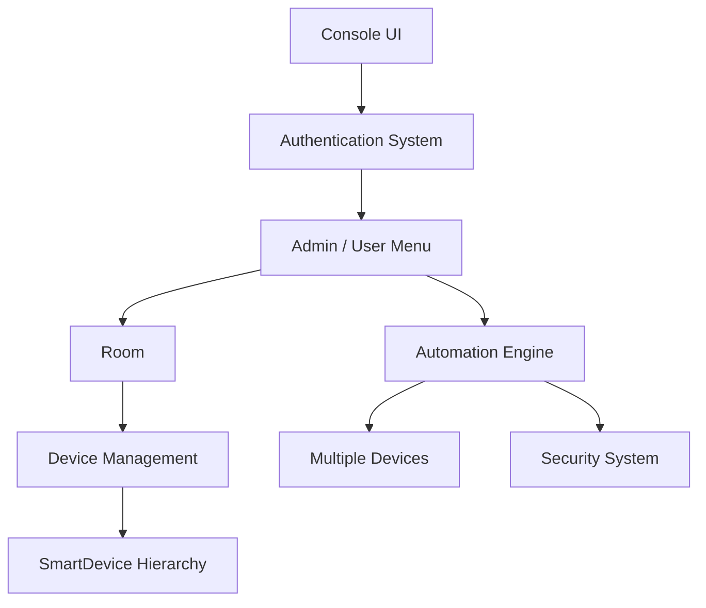

---

## 🧩 Class Diagram

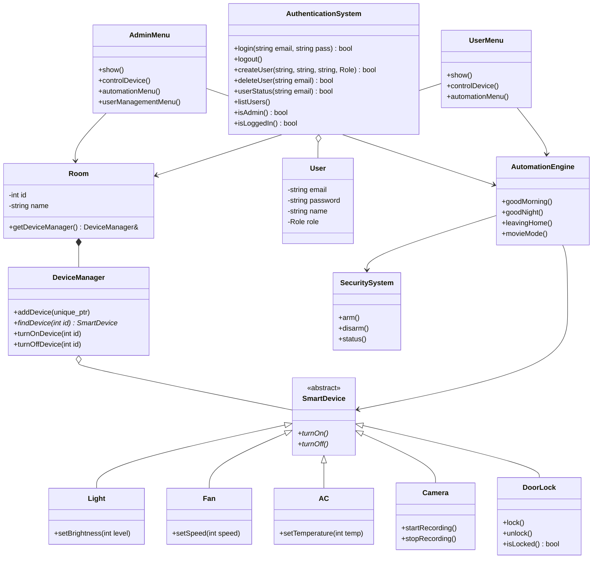

---

## 🔄 System Flow

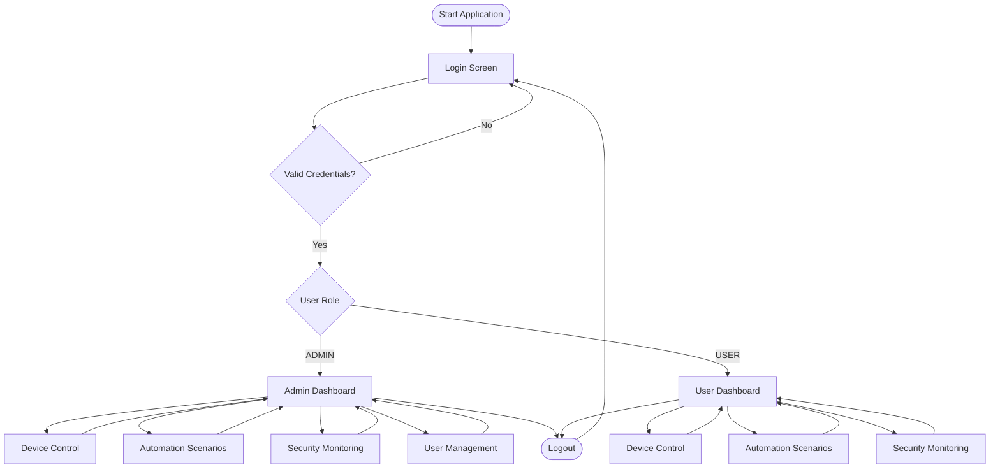

---

## 🎛️ Device Control Flow

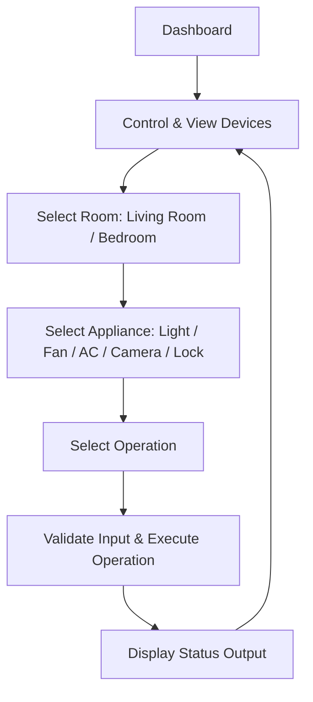

---

## 🌙 Automation Flow

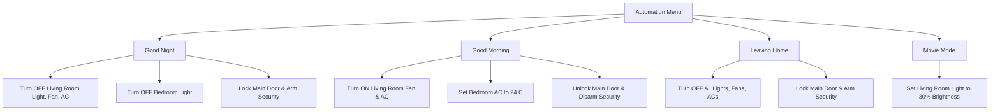

---

## 🧠 Object-Oriented Design

The architecture grounds itself in the foundational pillars of object-oriented programming:

### 1. Encapsulation
Internal state variables (such as operational status, brightness percentage, fan velocity, thermostat target, and lock states) are declared `protected` or `private`. Modifications occur exclusively through public getters and validated setter methods to prevent invalid state configurations.

### 2. Abstraction
`SmartDevice` acts as an abstract base contract outlining the baseline behaviors required of every device:

```cpp
class SmartDevice {
public:
    virtual void turnOn() = 0;
    virtual void turnOff() = 0;
    virtual ~SmartDevice() = default;
};
```

### 3. Inheritance
Specialized device implementations extend the shared base contract, inheriting common identity fields while introducing device-specific behaviors:

```
SmartDevice
├── Light
├── Fan
├── AC
├── Camera
└── DoorLock
```

### 4. Polymorphism
Upcasted `SmartDevice` references enable uniform manipulation of diverse hardware. Virtual method dispatches guarantee that operations like `turnOn()` or `turnOff()` invoke the appropriate child class implementation at runtime.

### 5. Composition
A `Room` instance maintains a `DeviceManager` via a **has-a** relationship, which in turn aggregates and manages individual smart devices. This composition pattern mirrors physical containment: rooms own their local device clusters.

---

## 🧰 STL & Modern C++ Features

| Modern C++ Feature | Implementation in ControlSphere |
|:---|:---|
| `std::unordered_map` | Fast $\mathcal{O}(1)$ average-case account lookup indexed by unique user email in `AuthenticationSystem` |
| `std::vector` | Dynamic storage and iteration over polymorphic device pointers within `DeviceManager` |
| `std::unique_ptr` | Explicit single-ownership resource management for smart devices, ensuring leak-free RAII cleanup |
| `std::string` | Handling usernames, credentials, device tags, and room identifiers across modules |
| References (`&`) | Passing core subsystems (rooms, authentication, security engine) across menus without copying overhead |
| Virtual Functions | Enabling dynamic runtime dispatch for `turnOn()` and `turnOff()` across derived device types |
| Abstract Classes | Defining a standardized polymorphic interface (`SmartDevice`) with pure virtual methods |
| `dynamic_cast` | Safe runtime downcasting from `SmartDevice*` to specialized interfaces (`Light*`, `Fan*`, `AC*`, `DoorLock*`) |
| Header / Source Separation | Modular layout with header declarations in `include/` and definitions in `src/` |
| Include Guards | Preprocessor guards (`#ifndef` / `#define`) preventing duplicate header inclusion during compilation |

---

## 🧮 Memory Management

ControlSphere adheres to modern C++ RAII (*Resource Acquisition Is Initialization*) guidelines:

- **Smart Pointers** — Devices are managed using `std::unique_ptr<SmartDevice>`, providing clear single-ownership semantics under `DeviceManager`.
- **Automatic Deallocation** — When a `Room` or `DeviceManager` falls out of scope, all managed devices are cleaned up automatically without explicit `delete` calls.
- **Leak Prevention** — Virtual destructors ensure proper teardown of derived device classes, eliminating resource leak risks.

---

## ✅ Input Validation

The console interface incorporates defensive input processing to prevent crashes and endless input loops:

- Non-numeric input recovery (clearing `cin.fail()` states and flushing the input buffer with `cin.ignore()`)
- Out-of-bounds menu selection rejection
- Device parameter boundaries (validating fan speeds between 1–3, light brightness between 0–100%, and thermostat limits between 16–30 °C)
- Duplicate email prevention during user registration
- Validation of required user roles (`ADMIN` vs `USER`)

---

## 📊 Complexity Analysis

| Operation | Average Case | Worst Case | Complexity Rationale |
|:---|:---:|:---:|:---|
| User lookup by email | $\mathcal{O}(1)$ | $\mathcal{O}(n)$ | Hash table lookup via `std::unordered_map`; degrades to linear only under hash bucket collisions |
| Device lookup by ID | $\mathcal{O}(n)$ | $\mathcal{O}(n)$ | Linear search through room device vector via `DeviceManager::findDevice` |
| Automation preset execution | $\mathcal{O}(1)$ | $\mathcal{O}(1)$ | Predetermined sequence of device and security state modifications across fixed room layout |

---

## 📁 Project Structure

```
ControlSphere/
├── docs/
│   └── screenshots/
├── include/
│   ├── SmartDevice.h
│   ├── Light.h
│   ├── Fan.h
│   ├── AC.h
│   ├── Camera.h
│   ├── DoorLock.h
│   ├── Room.h
│   ├── DeviceManager.h
│   ├── AuthenticationSystem.h
│   ├── User.h
│   ├── AdminMenu.h
│   ├── UserMenu.h
│   ├── AutomationEngine.h
│   ├── SecuritySystem.h
│   └── DeviceIds.h
├── src/
│   └── (corresponding .cpp implementation files)
├── .gitignore
├── main.cpp
└── README.md
```

---

## 🛠️ Build & Run

### Prerequisites
- A C++17-compatible compiler (GCC / MinGW recommended)
- A terminal environment (PowerShell, Command Prompt, Git Bash, or Linux shell)

### Build
Compile the complete project from the root directory:
```bash
g++ -std=c++17 main.cpp src/*.cpp -Iinclude -o ControlSphere
```

### Run

**Linux / Git Bash:**
```bash
./ControlSphere
```

**Windows (PowerShell / Command Prompt):**
```bash
.\ControlSphere.exe
```

---

## 📸 Demo

### 🔐 Login

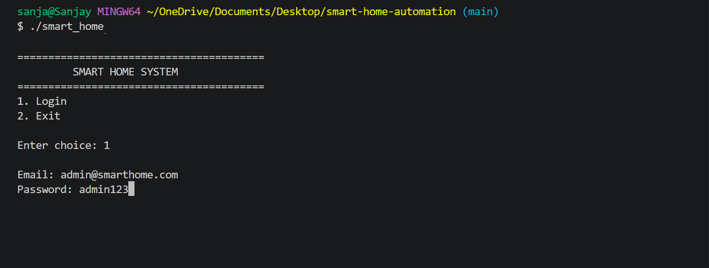

### 👨‍💼 Admin Dashboard

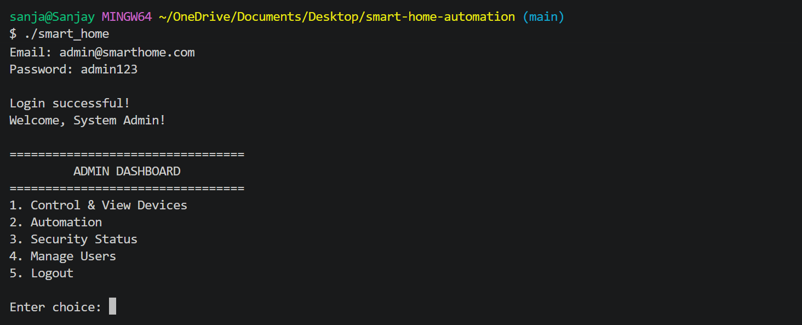

### 🎛️ Device Control

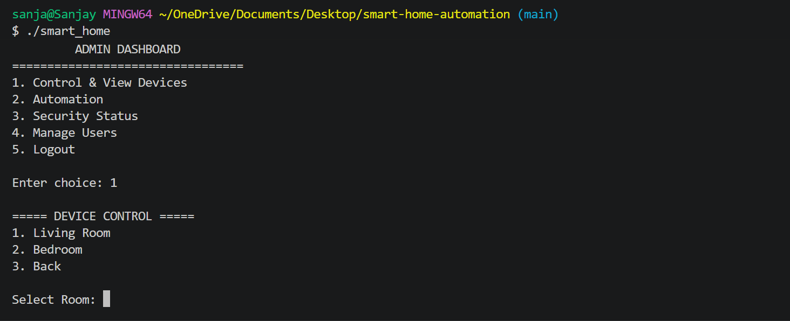

### 🤖 Automation System

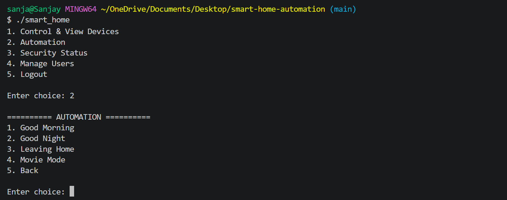

### 👥 User Management

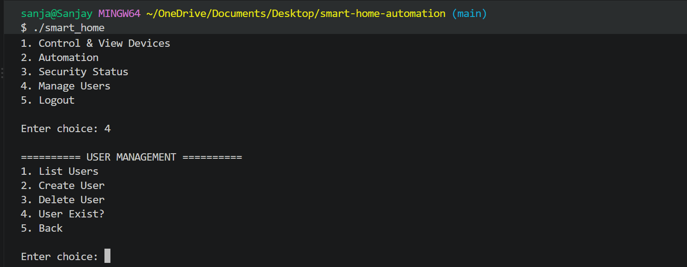

### 🛡️ Security Status

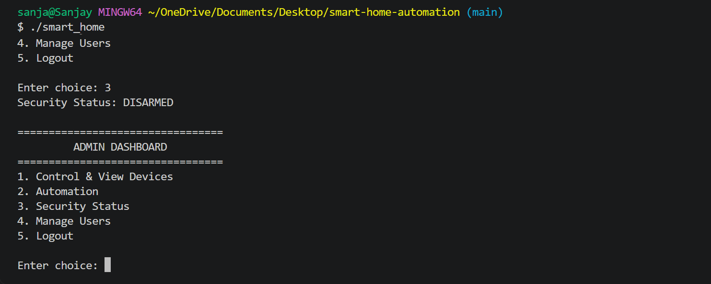

### 👤 User Dashboard

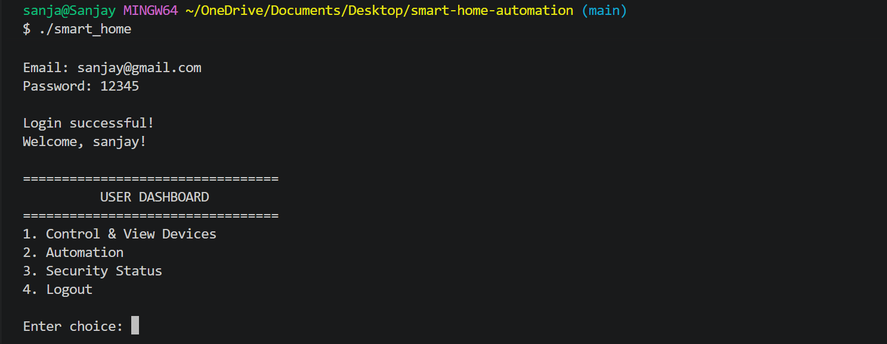

---

## 🧪 Manual Testing

The following functional verification matrix outlines key scenarios verified in manual test runs:

- [x] Admin login with default credentials (`admin@smarthome.com` / `admin123`)
- [x] Standard user registration and subsequent login
- [x] Clean session logout and return to main landing prompt
- [x] Rejection of duplicate email account registrations
- [x] Defense against invalid credential inputs
- [x] Multi-room navigation (Living Room and Bedroom)
- [x] Light controls (toggling power, adjusting brightness 0–100%)
- [x] Fan controls (toggling power, validating speeds 1–3)
- [x] AC controls (toggling power, setting temperature 16–30 °C)
- [x] Camera operations (toggling power, starting / stopping recording)
- [x] Door lock actuation (engaging lock, releasing unlock)
- [x] Perimeter security system arming, disarming, and status inspection
- [x] Execution of Good Night automation scenario
- [x] Execution of Good Morning automation scenario
- [x] Execution of Leaving Home automation scenario
- [x] Execution of Movie Mode automation scenario
- [x] Admin account operations (creating accounts, listing users, checking user status)
- [x] Input validation against non-numeric entries and out-of-range menu selections

> All system pathways are currently verified through manual interactive testing.

---

## 🚀 Future Improvements

Areas planned for potential architectural expansion include:

- Persistent database integration (SQLite or file-backed serialization)
- Secure credential storage using cryptographic hashing (e.g., bcrypt or Argon2)
- Multi-threaded device simulation and event-driven notifications
- Scheduled or cron-like automation triggers
- REST API layer or web-based frontend interface
- Hardware integration with physical IoT protocols (MQTT, Zigbee)
- Energy consumption tracking and reporting per device

---

## 🧑‍💻 Technical Skills Demonstrated

`C++` `C++17` `OOP` `STL` `Inheritance` `Polymorphism` `Abstraction` `Encapsulation` `Composition` `Smart Pointers` `RAII` `unordered_map` `System Design` `Input Validation` `Modular Architecture`

---

## 👤 Author

**Sanoj Kumar**
