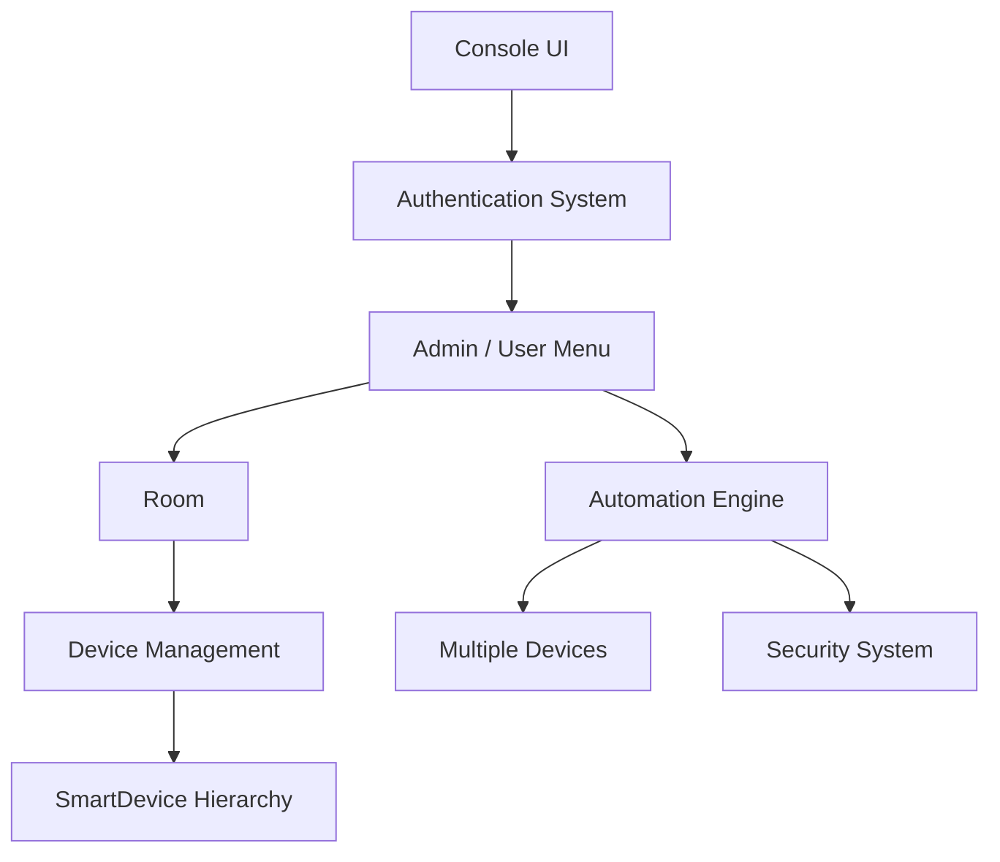
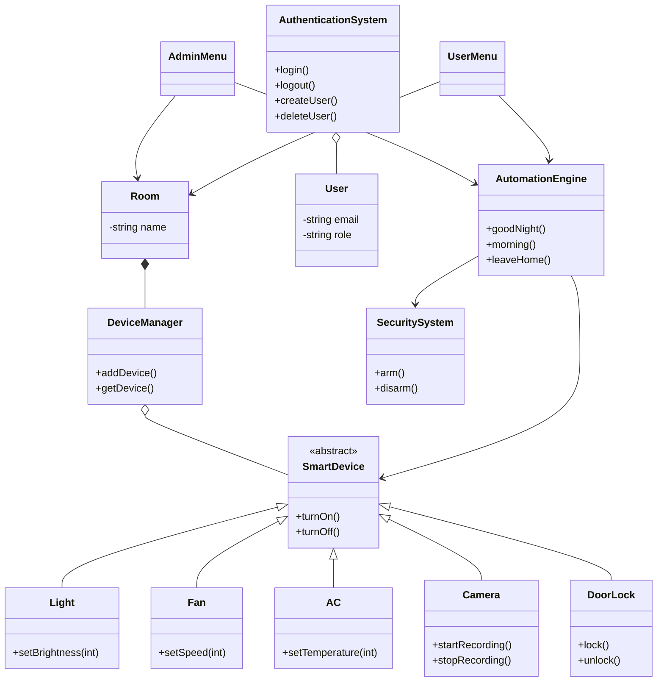
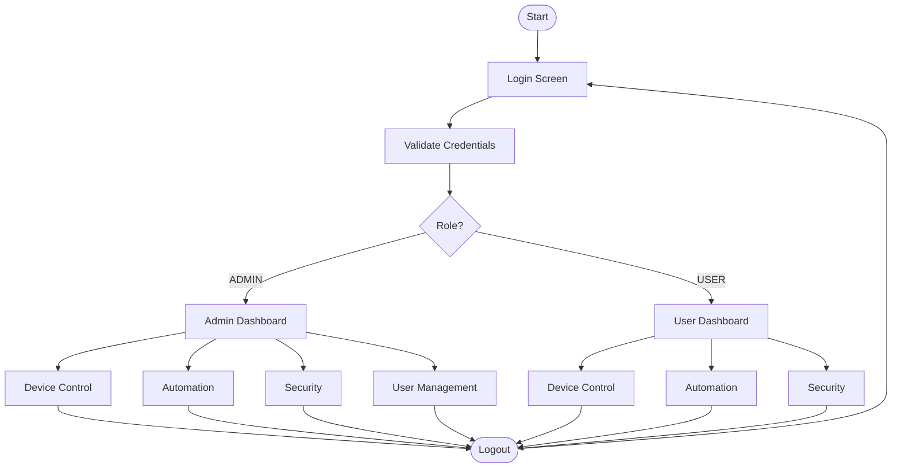
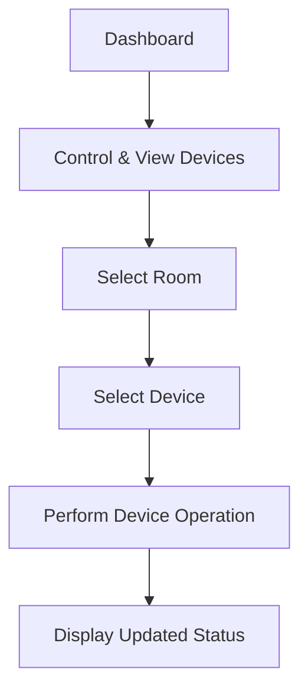
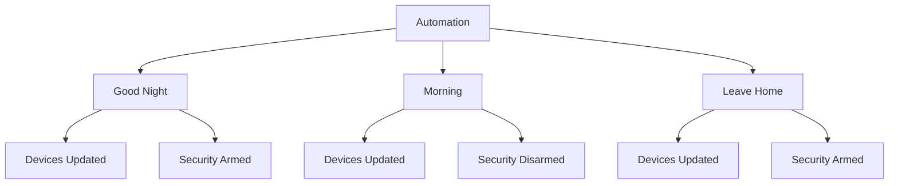

# 🏠 ControlSphere — Smart Home Automation System (C++17)

> A console-based smart home simulation built in modern C++17, demonstrating real-world object-oriented design, role-based authentication, and device automation.


---

## 📖 Overview

**ControlSphere** is a console-based smart home automation system written entirely in **C++17** that models a smart home consisting of multiple rooms and smart devices. It simulates real-world home automation logic — including **role-based authentication**, **device control**, **security management**, and **predefined automation scenarios** — while serving as a practical demonstration of object-oriented software design.

The system currently manages two rooms:

- **Living Room**
- **Bedroom**

Each room is automatically populated with a predefined set of smart devices when it is created — **Light, Fan, Air Conditioner (AC), Camera, and Door Lock**.

This project was built to demonstrate practical application of OOP principles, STL usage, memory management, and modular C++ system design — not as a toy exercise, but as a structured, extensible system.

---

## ✨ Key Features

| Category | Capabilities |
|---|---|
| **Authentication** | Role-based login (Admin / User), unique email identification, duplicate-account prevention, credential management |
| **Device Control** | Light, Fan, AC, Camera, Door Lock — each with independent, validated state control |
| **Automation** | Predefined scenarios: Good Night, Morning, Leave Home |
| **Security** | Arm / Disarm system with live status reporting |
| **User Management** | Admin-only creation, deletion, lookup, and modification of user accounts |
| **Input Validation** | Guards against invalid menu choices, non-numeric input, invalid device parameters |

---

## 🔐 Authentication System

The application implements a **role-based authentication system** with two distinct roles: `ADMIN` and `USER`.

- Login / Logout
- Unique, email-based account identification
- Duplicate email/account prevention
- Password-based login with role validation
- Admin-only user creation, deletion, and modification
- Admin authentication against reserved administrator credentials

User accounts are stored in an STL `unordered_map`, keyed by email, for efficient average-case account lookup.

> **Note:** This is an educational-grade authentication mechanism. It does **not** implement password hashing, encryption, or cryptographically secure credential storage.

---

## 🖥️ Dashboards

### Admin Dashboard
1. Control & View Devices
2. Automation
3. Security Status
4. Manage Users
5. Logout

### User Dashboard
1. Control & View Devices
2. Automation
3. Security Status
4. Logout

Users can select rooms, view and control devices, run automation scenarios, and check security status — but do **not** have access to user management functionality, which is restricted to Admin accounts.

---

## 🏘️ Room & Device Structure

| Room | Devices |
|---|---|
| **Living Room** | Light, Fan, AC, Camera, Door Lock |
| **Bedroom** | Light, Fan, AC, Camera, Door Lock |

Devices are automatically instantiated when a `Room` object is created. The system does not currently support dynamic addition or removal of devices during normal operation — the device layout is fixed by design.

---

## 🔌 Device Functionality

| Device | Capabilities |
|---|---|
| **Light** | Turn ON / OFF, change brightness (0–100, validated) |
| **Fan** | Turn ON / OFF, change speed (validated) |
| **AC** | Turn ON / OFF, change temperature (validated) |
| **Camera** | Turn ON / OFF, start / stop recording |
| **Door Lock** | Lock / Unlock, maintain lock status |

All device classes derive from a common abstract base class, `SmartDevice`, ensuring consistent behavior across the device hierarchy.

---

## 🛡️ Security System

The `SecuritySystem` component manages the home's overall security state:

- **Arm** the system
- **Disarm** the system
- **Display** current security status

```
Security Status: ARMED
```

---

## ⚙️ Automation

The system includes an **Automation Engine** with three predefined scenarios:

| Mode | Behavior |
|---|---|
| **Good Night** | Turns off appropriate lights and fans, configures AC, locks doors, arms security system |
| **Morning** | Turns on selected devices, unlocks doors, disarms security system |
| **Leave Home** | Turns off lights, fans, and AC, locks doors, arms security system |

Each automation mode demonstrates coordination across multiple independent system components — devices and security — triggered by a single user action.

---

## 🏗️ Architecture



---

## 🧩 Class Diagram



---

## 🔄 System Flow



---

## 🎛️ Device Control Flow



---

## 🌙 Automation Flow



---

## 🧠 Object-Oriented Design

This project applies all four core OOP pillars using real components from the system:

### 1. Encapsulation
Device state (power status, brightness, speed, temperature, lock state) is kept private and exposed only through controlled public methods, preventing invalid external state mutation.

### 2. Abstraction
`SmartDevice` is an abstract base class defining a common interface for all devices:

```cpp
class SmartDevice {
public:
    virtual void turnOn() = 0;
    virtual void turnOff() = 0;
    virtual ~SmartDevice() = default;
};
```

### 3. Inheritance
Concrete devices extend the shared abstraction:

```
SmartDevice
├── Light
├── Fan
├── AC
├── Camera
└── DoorLock
```

### 4. Polymorphism
`SmartDevice` pointers/references can refer to any concrete device type. Calling a virtual method (e.g. `turnOn()`) invokes the correct device-specific override at runtime.

### 5. Composition
`Room` **has-a** `DeviceManager`, which manages a collection of `SmartDevice` objects. This composition relationship models real-world ownership: a room owns and manages its devices, rather than devices existing independently.

---

## 🧰 STL & Modern C++ Features

| Feature | Purpose in This Project |
|---|---|
| `unordered_map` | Fast average-case lookup of user accounts by email |
| `vector` | Dynamic storage of devices and menu-driven collections |
| `unique_ptr` | Exclusive ownership and automatic cleanup of device objects |
| `string` | Managing user credentials, device names, and identifiers |
| References | Avoiding unnecessary copies when passing objects between functions |
| Virtual functions | Enabling polymorphic device behavior |
| Abstract classes | Defining a consistent device interface (`SmartDevice`) |
| `dynamic_cast` | Safe downcasting when device-specific behavior is required |
| Header/source separation | Clean modular structure and faster compilation |
| Include guards | Preventing duplicate header inclusion |

---

## 🧮 Memory Management

The project uses smart pointers — specifically `unique_ptr<SmartDevice>` — to manage device lifetimes.

- **RAII** — resources are tied to object lifetime, ensuring automatic cleanup
- **Automatic memory management** — no manual `delete` calls required
- **Clear ownership semantics** — `DeviceManager` exclusively owns its devices
- **Reduced memory leak risk** compared to raw pointer management

---

## ✅ Input Validation

The application defensively handles a range of invalid inputs, including:

- Invalid menu choices
- Non-numeric menu input
- Invalid device selections
- Duplicate email registration
- Unknown user lookups
- Invalid role assignment
- Out-of-range brightness values
- Out-of-range fan speed
- Out-of-range AC temperature

Input-stream failure handling (e.g. clearing failed `cin` states) is used where applicable to prevent infinite menu loops on invalid input.

---

## 📊 Complexity Analysis

| Operation | Average Case | Worst Case |
|---|---|---|
| User lookup by email (`unordered_map`) | O(1) | O(n) |
| Device lookup (linear search) | O(n) | O(n) |
| Automation execution (fixed device set) | O(1) | O(1) |

> `unordered_map` provides average-case O(1) lookup via hashing; worst-case degrades to O(n) under hash collisions.

---

## 📁 Project Structure

```
ControlSphere/
├── docs/
│   └── screenshots/
├── include/
│   ├── SmartDevice.h
│   ├── Light.h
│   ├── Fan.h
│   ├── AC.h
│   ├── Camera.h
│   ├── DoorLock.h
│   ├── Room.h
│   ├── DeviceManager.h
│   ├── AuthenticationSystem.h
│   ├── User.h
│   ├── AdminMenu.h
│   ├── UserMenu.h
│   ├── AutomationEngine.h
│   ├── SecuritySystem.h
│   └── DeviceIds.h
├── src/
│   └── (corresponding .cpp implementation files)
├── .gitignore
├── main.cpp
└── README.md
```

---

## 🛠️ Build & Run

### Prerequisites
- A C++17-compatible compiler (GCC / MinGW recommended)
- A terminal (Git Bash, Linux shell, or Windows terminal / PowerShell)

### Build
```bash
g++ -std=c++17 main.cpp src/*.cpp -Iinclude -o ControlSphere
```

### Run

**Linux / Git Bash:**
```bash
./ControlSphere
```

**Windows:**
```bash
./ControlSphere.exe
```

---

## 📸 Demo

### 🔐 Login


### 👨‍💼 Admin Dashboard


### 🎛️ Device Control


### 🤖 Automation System


### 👥 User Management


### 🛡️ Security Status


### 👤 User Dashboard


---

## 🧪 Manual Testing

The following checklist covers the core functional paths verified through manual testing:

- [ ] Admin login
- [ ] User login
- [ ] Logout
- [ ] Duplicate email rejection
- [ ] Invalid credentials handling
- [ ] Room selection
- [ ] Light control (on/off/brightness)
- [ ] Fan control (on/off/speed)
- [ ] AC control (on/off/temperature)
- [ ] Camera control (on/off/recording)
- [ ] Door lock control
- [ ] Security system arm/disarm
- [ ] Good Night automation
- [ ] Morning automation
- [ ] Leave Home automation
- [ ] Admin user management (create/delete/modify)
- [ ] Invalid menu input handling
- [ ] Invalid device input handling

> No automated unit test suite currently exists; all verification is performed manually.

---

## 🚀 Future Improvements

The following are potential future directions and are **not** part of the current implementation:

- Persistent storage / database integration
- Password hashing and credential encryption
- REST API layer
- Web or GUI interface
- Scheduled/time-based automation
- Event-driven architecture
- Multithreading support
- IoT / real device communication
- Energy consumption monitoring
- Notification system
- Cloud synchronization

---

## 🧑‍💻 Technical Skills Demonstrated

`C++` `C++17` `OOP` `STL` `Inheritance` `Polymorphism` `Abstraction` `Encapsulation` `Composition` `Smart Pointers` `unordered_map` `System Design` `Input Validation` `Modular Architecture`


## 👤 Author

**Sanjay Kumar**
B.Tech-Electrical Engineering
IIT (ISM) Dhanbad
